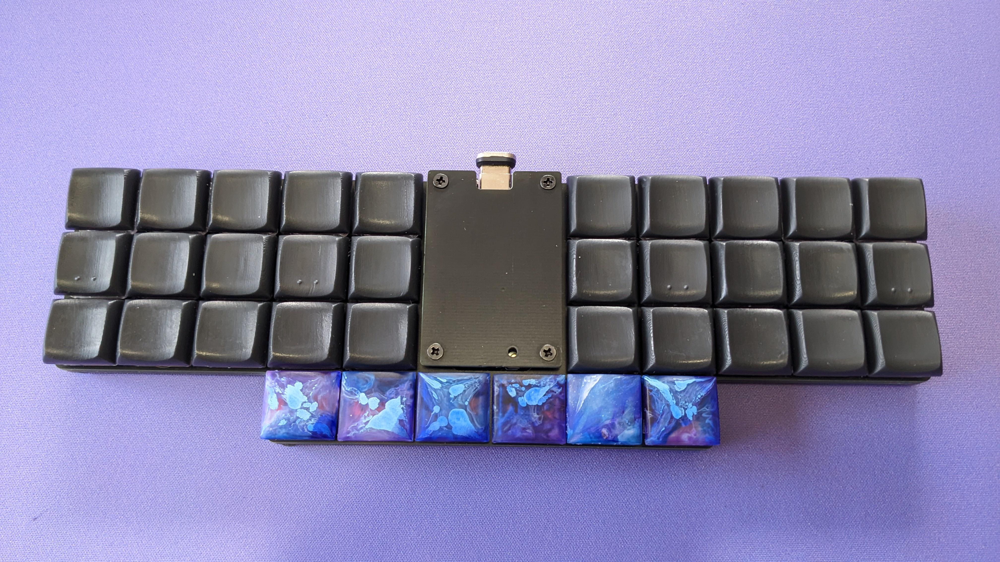

# Kurp
## 36 Key unibody split ortholinear

## PCB Render

Kurp is a choc-spaced unibody split ortholinear keyboard.

## Materials

| Description | Part | Count | Notes |
| :---: | :---: | :---: | :---: |
| PCBs | [Main](pcbs/pcb/jlcpcb/production_files) | 1 | |
|| [Switchplate](pcbs/switchplate/jlcpcb/production_files) | 1 | Optional |
|| [Backplate](pcbs/backplate/jlcpcb/production_files) | 1 | Optional |
|| [Centerplate](pcbs/centerplate/jlcpcb/production_files) | 1 | Optional |
| Controller | ProMicro footprint | 1 |  | 
| Diodes | 1N4148 SOD-123  | 36 |  |
| Switches | Choc v1 | 36 |  | 
| Keycaps | 1u | 36 | |
| Reset | TL3342F260QG | 1 | |
| Display | SSD1306 | 1 | Optional |
| | nice!view |  | Wireless Only |
| Power Switch |  MSK-12C02 | 1 | Wireless Only | 
| Battery Connector | TBD | 1 | Optional, Wireless Only | 
| Battery | TBD | 1 | Wireless Only |
| 3mm M2 Standoff ||8||
| 9mm M2 Standoff ||4||
| 3mm M2 Screw ||24||

## Firmware
QMK : https://github.com/jasonhazel/qmk_firmware/tree/hazel/kurp
